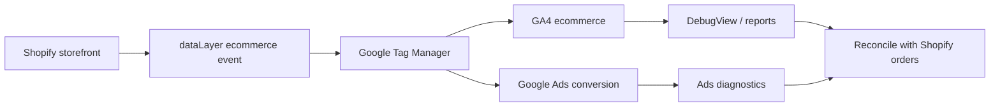

# Shopify + Google Ads Conversion Tracking

> **Reliable ecommerce conversion tracking with GA4, GTM, Google Ads and Shopify order reconciliation.**

[](https://github.com/beltebaiken-star/shopify-google-ads-conversion-tracking)
[](https://github.com/beltebaiken-star/shopify-google-ads-conversion-tracking)
[](https://www.upwork.com/freelancers/baikenbelte)

## Client problem

Store owners often see missing purchases, duplicate conversions, wrong revenue, or Google Ads numbers that do not reconcile with Shopify.

## What this project proves

This portfolio project demonstrates a clean purchase event contract, transaction ID/value/currency validation, and a zero-dependency test that checks the payload before tags consume it.

## Architecture



## Quick start

```bash
git clone https://github.com/beltebaiken-star/shopify-google-ads-conversion-tracking.git
cd shopify-google-ads-conversion-tracking
npm test
```

**What the demo checks:** Validates a synthetic purchase event for transaction ID, numeric value, currency and item data.

No external credentials or paid services are required for this demo.

## What I would deliver on a client project

- Tracking architecture audit
- GTM / dataLayer implementation plan
- Purchase and funnel event validation
- Google Ads conversion mapping
- GA4 DebugView verification
- Duplicate/missing conversion diagnosis
- Shopify order-to-platform reconciliation checklist

## Production QA principles

- Diagnose the failing layer before changing production code.
- Keep identifiers, values and platform mappings consistent end-to-end.
- Test both success and failure paths.
- Check for duplicates, missing events/data, and stale configuration.
- Reconcile platform output against Shopify/store source-of-truth data.
- Document the fix and leave a repeatable verification checklist.

## Repository map

```text
demo/                 runnable synthetic validation
examples/             safe sample payloads / implementation snippets
docs/architecture.md  technical architecture notes
docs/qa-checklist.md  production verification checklist
README.md              client-facing case study
```

## Security & portfolio note

This repository is a **sanitized technical portfolio demo**. It intentionally excludes customer data, production credentials, private URLs, access tokens and proprietary client code.

## Hire / contact

I take on focused Shopify, ecommerce tracking, analytics, GMC and integration projects.

**Upwork:** https://www.upwork.com/freelancers/baikenbelte
